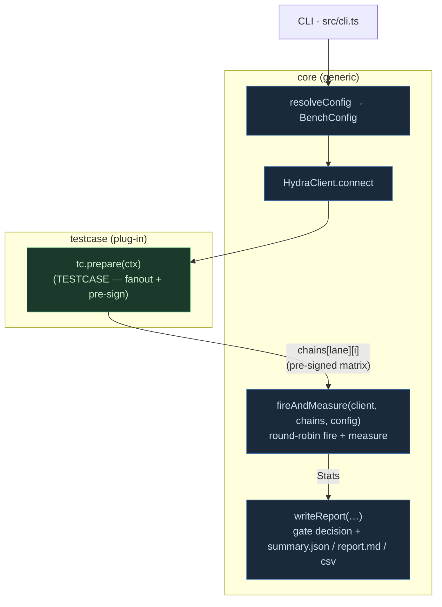
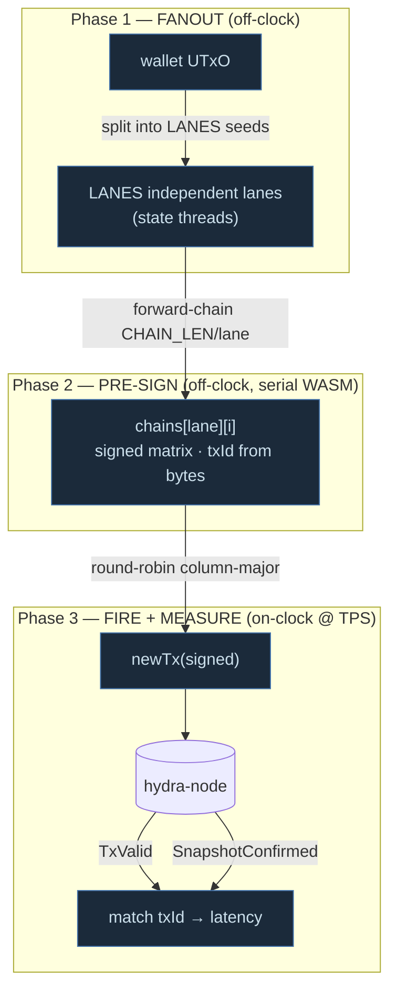

# Architecture

The harness splits cleanly into a **testcase-agnostic core** and **pluggable testcases**. The core never builds a transaction; a testcase never runs the timed loop. That boundary is what makes new workloads cheap to add.

## Modules

| File | Responsibility |
|---|---|
| `src/core/config.ts` | resolve CLI argv + env → `BenchConfig`; r1-style lanes/chain sizing |
| `src/core/hydra.ts` | `HydraClient` — the only place that knows the Hydra WS/HTTP protocol (connect, query/await UTxO, `submitTxSync` for setup, `newTx` for the hot path, message subscription) |
| `src/core/types.ts` | the `Testcase` plug-in contract + `Signed` / `GateSpec` / `PrepareContext` |
| `src/core/registry.ts` | global testcase registry (`register` / `getTestcase` / `listTestcases`) |
| `src/core/metrics.ts` | `nowMs` (monotonic clock), `pct`, `steadyBlock` (warmup-trimmed percentiles) |
| `src/core/runner.ts` | `fireAndMeasure` — the generic FIRE+MEASURE loop, open-/closed-loop, drain |
| `src/core/reporter.ts` | `writeReport` — gate logic, batching analysis, node-vs-client, artifacts |
| `src/cli.ts` | entrypoint: parse → connect → `prepare` → `fireAndMeasure` → `writeReport` |
| `src/testcases/<name>/` | a testcase (tx shape, fanout, pre-sign) + any blueprint it needs |
| `src/testcases/index.ts` | manifest: imports + `register`s every testcase |

## The three-phase model (why the numbers are the *node's*)

1. **Fanout (off-clock)** — `tc.prepare` spends the wallet into `LANES` independent seed lanes (state threads). Each lane has its own inputs, so lanes never collide.
2. **Pre-sign (off-clock)** — for each lane, forward-chain `CHAIN_LEN` txs; the next tx spends the previous tx's outputs, with txIds computed from the signed bytes (no node round-trip). Signing (serial WASM, the slow part) happens **before the clock starts**.
3. **Fire + measure (on-clock)** — `fireAndMeasure` emits the matrix round-robin (column-major: every lane's tx `i`, then `i+1`, …) at the target TPS. Firing is just `newTx(bytes)`, so the rig genuinely *offers* the target rate and any remaining ceiling is the node's, not the rig's.

Round-robin means a lane is revisited only every `LANES/TPS` seconds — keep `LANES ≥ TPS` so a chained predecessor is applied before its successor lands (otherwise you get **stale-input races**, which are bucketed separately and never fail the gate).

## Open-loop vs closed-loop

- **Open-loop** (`BENCH_INFLIGHT_MAX=0`): fire at a fixed `1000/TPS` cadence, no backpressure. Under node saturation P95 becomes *queue time*, not real latency.
- **Closed-loop** (`BENCH_INFLIGHT_MAX=K`): block until an un-acked slot frees, so submit-rate self-throttles to confirm-rate (Little's Law: `K ≈ confirmTps × target_latency_s`). Measured P95 ≈ one real confirm cycle. `BENCH_INFLIGHT_GATE` picks which ack frees a slot (`txvalid` = matching latency, `snapshot` = settlement latency).

## Two latencies, two meanings

Both are always recorded; the testcase's `gate.metric` picks which one decides PASS/FAIL.

- **TxValid** = node applied the state transition locally — the *matching responsiveness* metric. This is what `perp-state` gates on.
- **SnapshotConfirmed** = settled in a multi-party-signed snapshot — the *settlement* metric, and the only state safe to fan out / withdraw against. Hydra batches snapshots on a cadence, so per-tx snapshot P95 ≤ 200 ms is **not** an achievable target and must not gate matching.
